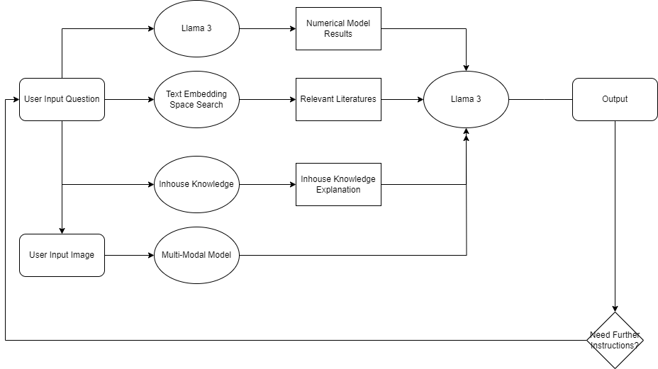
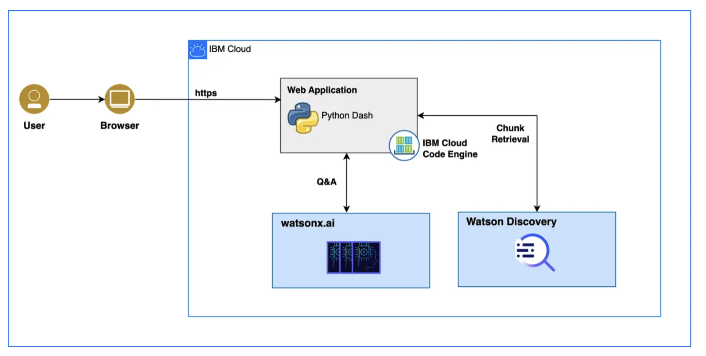

# callforcode_watsonx

## Deliverable: Describe how IBM watsonx product(s) would be used

- [Text Embedding Models](https://eu-de.dataplatform.cloud.ibm.com/docs/content/wsj/analyze-data/fm-models-embed.html?context=wx): We will watsonx text embedding models to convert our knowledge base data into a word embedding space. This will allow us to perform similarity searches and clustering on the data, thus enabling us to provide more relevant search results to our users and improve the speed of our search engine.
- [llama-3-70b-instruct](https://www.ibm.com/products/watsonx-ai/foundation-models): The llama-3-70b-instruct model provided by watsonx AI will be used for the following purposes:
  - **Converting Questions**: When the user asks a question, we will use the llama-3-70b-instruct model to convert the question into codes that can be understood by our climate model. This will allow us to provide more accurate and relevant answers to the user's questions.
  - **Generating Answers**: The backend of our product will return the generated answers to the user's questions, along with the information from the knowledge base. The llama-3-70b-instruct model will be used to generate these answers based on these information to address the user's queries in a human-like manner.
- [Multi-model AI](https://www.ibm.com/products/watsonx-ai): The image can carry important information, or help users to understand the content better. We will develop a multi-modal AI system that can process both text and image data. This will allow us to provide more comprehensive and accurate answers to the user's questions, and improve the overall user experience of our product.
- [watsonx.data](https://www.ibm.com/products/watsonx-data): We will use watsonx.data to store and manage the knowledge base data of our product. This will allow us to easily access and update the data.
- [watsonx-governance](https://www.ibm.com/products/watsonx-governance): We will use watsonx-governance to monitor and manage the usage of our product and evaluate the performance of our climate model. This will help us to improve the quality of our product and provide better services to our users.

## Deliverable: Describe data sources and other technology to be used

To effectively address the challenges of managing New York's coastline flood hazards, our approach relies on a variety of rich data sources and cutting-edge technology:

**Data Sources:**

1. **Climate Research Papers and Reports**: Academic journals, research institutions, and government reports provide a wealth of information on climate modeling, historical climate data, and projections of future conditions.

2. **Coastal Topography and Bathymetry Data**: High-resolution datasets that detail the physical characteristics of the coastline and seabed are essential for accurate modeling of flood scenarios.

3. **Meteorological Data**: Real-time and historical weather data, including information on wind, precipitation, atmospheric pressure, and storm tracking, are crucial for predicting storm surge events and wave dynamics.

4. **Demographic and Infrastructure Data**: Population distribution, land use, and infrastructure maps help in assessing the potential human impact and economic costs of coastal flooding.

5. **Remote Sensing Data**: Satellite imagery and aerial photography provide updates on land cover changes, barrier island dynamics, and post-storm damage assessments.

6. **Community Feedback and Local Knowledge**: Insights from local populations, businesses, and government agencies offer valuable context and ground-truth information for modeling and decision-making.

**Technology:**

1. **LLaMA 3 Large Language Model**: This advanced AI technology is employed for parsing and synthesizing the vast amounts of textual data from the literature. It aids in automated literature reviews, report generation, scenario simulation, and public communication materials.

2. **ADCIRC+SWAN Modeling System**: An integrated hydrodynamic and wave model to simulate tidal motion, storm surge, and wave propagation under a variety of weather conditions. This model provides highly detailed spatial and temporal predictions for water levels and wave characteristics along the coastline.

3. **BOUSS1D**: A one-dimensional Boussinesq wave model used to simulate wave transformation, breaking, and run-up in coastal areas. This model is particularly useful for understanding wave impacts on specific coastal structures and shorelines.

4. **Geographic Information Systems (GIS)**: GIS technology plays a pivotal role in visualizing, analyzing, and managing spatial data related to coastline features, infrastructure, and vulnerability.

5. **High-Performance Computing (HPC) Resources**: The computational demands of running sophisticated models like ADCIRC+SWAN and BOUSS1D, as well as processing large language models like LLaMA 3, require significant computing power, often provided by HPC clusters.

6. **Cloud-Based Platforms**: Cloud services facilitate data storage, sharing, and collaborative analysis, making it easier to integrate and scale up our modeling and AI processes.

## Deliverable: Solution architecture diagram

The architecture of our model is as follows:

The architecture of the deployment is as follows:

## Deliverable: Description of the issue you're hoping to solve

New York's coastline is increasingly vulnerable to the threats of climate change, with rising sea levels and intensifying storm events leading to recurrent flooding hazards. These hazards pose significant risks to infrastructure, ecosystems, and communities along the coastal areas. Traditional methods of managing these risks can be time-consuming and often fail to incorporate the latest climate research, leading to outdated or ineffective management strategies. Furthermore, there is a communication gap between scientific findings and public understanding, as well as between the various stakeholders involved in managing flood risks. This makes it challenging to formulate coordinated and proactive responses to the emerging threats.

## Deliverable: Description of how your solution can help solve the problem

Our solution is designed to address these problems through an integrative approach that combines the analytical prowess of advanced AI with robust coastal simulation models. Specifically, LLaMA 3's Large Language Model is used in conjunction with ADCIRC+SWAN and BOUSS1D models to enhance every aspect of coastline flood hazard management.

1. **Automated Literature Reviews**: By leveraging LLaMA 3, we can rapidly process and analyze large datasets from recent studies, reports, and historical data. This automated review process enables us to stay abreast of the latest scientific discoveries and technological advancements in real-time, ensuring that our management strategies are rooted in the most current understanding of climate change impacts.

2. **Policy and Decision Making Support**: The AI-driven system generates comprehensive reports and simulations of potential policy outcomes, providing policymakers with data-driven insights. These tools inform decisions, guiding the development of adaptive strategies that are both effective and aligned with the latest scientific research. Scenario planning is particularly beneficial in exploring the long-term effects of various management options, allowing for proactive rather than reactive measures.

3. **Public Communication and Education**: Clear and engaging educational content created by LLaMA 3 helps bridge the gap between complex scientific information and public comprehension. This fosters greater community involvement and supports informed dialogue about local climate challenges and solutions.

4. **Collaboration and Integration**: By serving as a platform for cross-disciplinary collaboration, our solution encourages the integration of diverse datasets and expert analyses. This collaborative environment is vital for producing comprehensive and nuanced assessments of flood hazards, leading to more holistic and coherent management efforts.

## Deliverable: Long description of your idea

New York City's coastline faces significant challenges posed by climate change and associated flood hazards, demanding innovative and interdisciplinary approaches to effective management. To tackle this issue head-on, our team is employing an advanced AI system, the Large Language Model (LLaMA 3), in concert with cutting-edge coastal simulation models, ADCIRC+SWAN and BOUSS1D. This integrated approach aims to revolutionize New York's coastline flood hazard management through enhanced prediction, analysis, and communication strategies.

Our first objective is to streamline the research process by conducting Automated Literature Reviews. Utilizing LLaMA 3's sophisticated text embedding capabilities, we will analyze vast troves of textual data from a multitude of sources, including scholarly articles, technical reports, and extensive climate databases. This process allows our researchers to efficiently synthesize scientific findings, extract crucial insights, and quickly identify trends and gaps in the current body of knowledge.

In support of Policy and Decision Making, LLaMA 3's advanced natural language processing will generate in-depth reports that articulate the implications of climate impacts, and evaluate both mitigation strategies and adaptation measures. These reports will draw from the most up-to-date research, providing policymakers with a robust evidence base. Additionally, LLaMA 3 will simulate various policy scenarios, crafting detailed narratives that explore the possible outcomes of different decision-making pathways, thereby enabling stakeholders to make informed choices about climate change interventions.

To bolster Public Communication and Education efforts, LLaMA 3 will be instrumental in producing accessible educational content. This material will demystify complex climate-related phenomena, articulating the critical role of sustainable practices and protective measures in safeguarding our coastline. By translating scientific jargon into clear, concise language, we aim to enhance public understanding and engagement with these vital issues.

Finally, our approach centers on Collaboration and Integration across various fields. By merging the capabilities of LLaMA 3 with the data processing power of ADCIRC+SWAN and BOUSS1D, we will break down silos between disciplines. This fusion not only facilitates a seamless exchange of data and ideas among climate scientists, data scientists, and AI experts but also produces multifaceted analyses that can guide comprehensive and cohesive management strategies.

In essence, our team is poised to deliver transformative solutions for New York's coastline flood hazard management, harnessing the synergy of AI and coastal modeling to inform research, guide policy, educate the public, and foster collaboration across disciplines.

## Video Link

